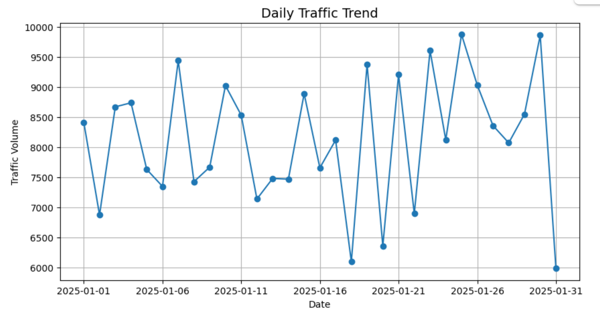
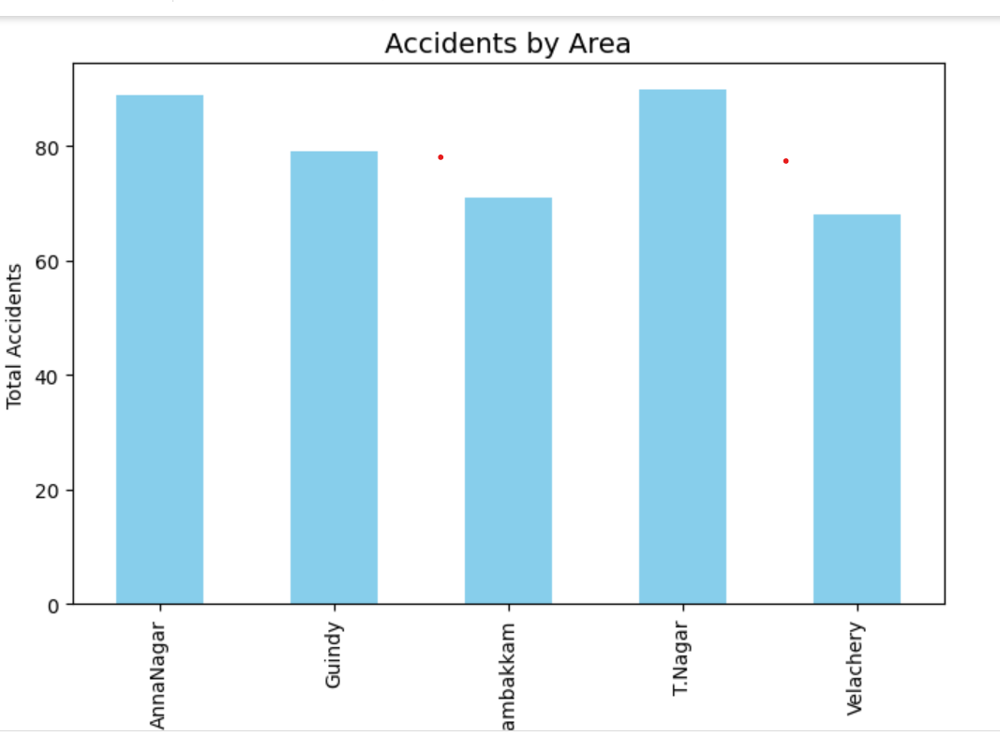
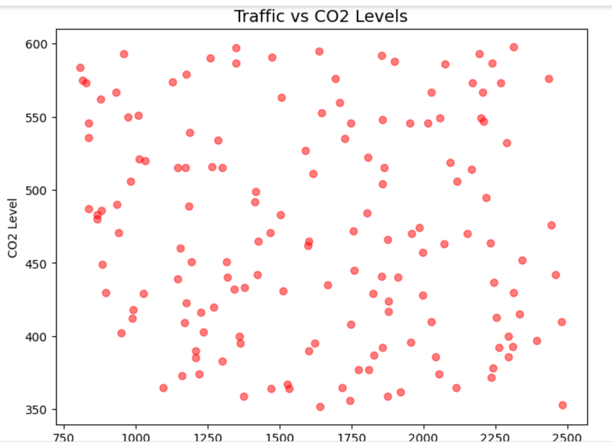

# 🚦 Smart City Traffic & Pollution Analysis

## 📌 Overview
This project uses **Python, Pandas, and NumPy** to analyze city traffic and pollution data.  
It finds traffic patterns, pollution impact, and accident risks for smart city planning.

## 🔧 Technologies
- Python 🐍
- Pandas 📊
- NumPy 🔢
- Matplotlib 📈

## 📂 Dataset
Synthetic dataset containing:
- Date, Area, Vehicle Count, Average Speed, CO2, PM2.5, Accidents

## 📸 Screenshots

## 🚀 Future Work
- Use ML to predict traffic & pollution trends
- Build interactive dashboard with Streamlit

## 📂 Features
✅ Traffic insights (busiest areas, peak dates)  
✅ Pollution analysis (CO2, PM2.5 vs vehicles)  
✅ Accident risk zones  
✅ Trend forecasting using moving average  
✅ Data visualizations

## 📂 Dataset
[Download CSV](city_traffic_pollution.csv)

